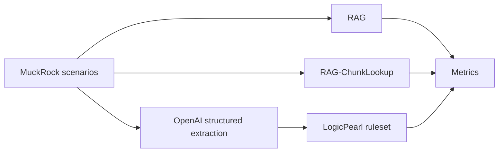

# rag-vs-pag

This is a small reproducible benchmark for one claim:

> LLMs are useful for turning messy text into facts. LogicPearl is for
> turning facts into governed decisions.

The task is FOIA exemption classification on real MuckRock request/response
records. The repo compares three pipelines:

| Pipeline | What happens at runtime |
|---|---|
| RAG | Retrieve FOIA authority chunks, then ask OpenAI for a verdict, rationale, and quoted excerpts. |
| RAG-ChunkLookup | Retrieve FOIA authority chunks, then ask OpenAI for a verdict, rationale, and chunk IDs. The app resolves citation text from stored chunks. |
| LogicPearl | Ask OpenAI to extract structured facts, then run a deterministic decision artifact for the verdict. |



There is no heuristic benchmark path. Unit tests mock OpenAI boundaries so
they can run offline, but every benchmark/report target uses the same
OpenAI-backed path.

## Quickstart

```bash
uv sync --extra dev
export OPENAI_API_KEY=...
uv run make final-report
```

Useful local checks:

```bash
uv run make smoke
```

`smoke` does not require OpenAI. It runs unit tests, ruleset regression, and
the ruleset diff.

Optional model override:

```bash
uv run make final-report OPENAI_MODEL=gpt-4o-mini
```

The default `make` target is `final-report`.

## What To Read First

- [Final benchmark report](docs/qa/final-benchmark-report.md)
- [Trace walkthrough](docs/demo/trace-viewer.md)
- [Glossary](docs/GLOSSARY.md)
- [Reproducibility note](docs/REPRODUCIBILITY.md)
- [Benchmark methodology log](docs/qa/benchmark-methodology-log.md)
- [Scenario map](scenarios/README.md)

## Results At A Glance

The headline result is not “LogicPearl solves FOIA law.” The defensible
result is narrower: under shared extracted facts, the versioned decision
artifact produces stable, inspectable, trace-valid decisions, while generated
baselines remain harder to audit.

Full live test set, ambiguity-aware acceptable-label scoring:

| Track | Pipeline | Acceptable | Trace-valid | Citation supports |
|---|---|---:|---:|---:|
| A: end-to-end | LogicPearl | 42/61 | 42/61 | 55/55 |
| A: end-to-end | RAG | 7/61 | - | 16/16 |
| A: end-to-end | RAG-ChunkLookup | 7/61 | - | 14/62 |
| B: shared facts | LogicPearl | 42/61 | 42/61 | 55/55 |
| B: shared facts | RAG | 14/61 | - | 28/36 |
| B: shared facts | RAG-ChunkLookup | 12/61 | - | 21/48 |

Approved-clean held-out test set:

| Track | Pipeline | Acceptable | Trace-valid | Citation supports |
|---|---|---:|---:|---:|
| A: end-to-end | LogicPearl | 6/13 | 6/13 | 11/11 |
| A: end-to-end | RAG | 3/13 | - | 5/5 |
| A: end-to-end | RAG-ChunkLookup | 3/13 | - | 4/20 |
| B: shared facts | LogicPearl | 6/13 | 6/13 | 11/11 |
| B: shared facts | RAG | 4/13 | - | 7/7 |
| B: shared facts | RAG-ChunkLookup | 5/13 | - | 6/16 |

The approved-clean set is intentionally conservative and small. It should be
used as an audit slice, not as a broad accuracy claim.

## Evaluation Tracks

| Track | What it tests |
|---|---|
| Track A: end-to-end | Each pipeline gets request text and agency name only. |
| Track B: shared facts | One OpenAI structured extractor produces a feature vector; every pipeline receives that same vector. |

Track B isolates the decision layer. It is not an end-to-end extraction
benchmark.

## Fairness Notes

- The OpenAI extractor returns features and evidence only. It does not choose the gold exemption.
- RAG and RAG-ChunkLookup are real OpenAI baselines, not heuristic stand-ins.
- Gold labels are agency-cited exemptions from MuckRock response text, not court-validated legal truth.
- Adjudication is deterministic and prediction-independent.
- Manual clean review records exclusions with reasons instead of silently dropping cases.
- Cached model rows make repeated local report runs stable; stability columns measure replay stability, not fresh sampling variance.

## Commands

Prefix with `uv run` unless you have already activated the project
environment.

```bash
make fetch                 # create the compact FOIA authority corpus
make index                 # build the lexical retrieval index
make build                 # build versioned decision artifacts
make extract-live          # create shared OpenAI structured facts
make adjudicate-live       # create clean/ambiguous/invalid benchmark labels
make manual-review-clean   # apply the human-reviewed clean subset
make demo-live             # run full live benchmark
make demo-clean-approved   # run manually approved clean benchmark
make trace-viewer          # generate a small trace walkthrough
make final-report          # regenerate benchmark reports
make smoke                 # no-OpenAI confidence check
make regression            # test ruleset behavior
make test                  # run unit tests with mocked OpenAI boundaries
make clean                 # remove generated artifacts
```

## Repo Map

```text
compare.py                 benchmark CLI wrapper
benchmark/                 benchmark runner, metrics, and summary generation
corpus/                    compact FOIA authority corpus source
extraction/                shared OpenAI structured extraction
pipelines/                 RAG, RAG-ChunkLookup, and LogicPearl adapters
pearl/                     versioned decision artifacts and rulesets
rag/                       lexical index and retrieval
scenarios/                 active benchmark inputs and review sidecars
scenarios/archive/         corpus-construction history
scripts/                   current benchmark report/adjudication scripts
scripts/corpus_build/      historical MuckRock scrape and QA helpers
docs/qa/                   final report and fairness audit trail
docs/demo/                 trace walkthrough
tests/                     unit tests with mocked OpenAI boundaries
```

Generated artifacts:

- `extraction/outputs/shared_features.100.live.openai.json`
- `transcripts/live-100-openai-summary.md`
- `transcripts/live-100-openai-clean-approved-summary.md`
- `docs/qa/final-benchmark-report.md`
- `docs/demo/trace-viewer.md`

## Decision Artifact Claim

The LLM does not disappear. LogicPearl uses an LLM for extraction. The
distinction is that the final classification decision can be pinned to:

- a ruleset version;
- a feature dictionary hash;
- a corpus manifest hash;
- a compiled artifact hash;
- a regression suite.

This makes the decision easier to audit than a generated verdict.

Suggested neutral language:

> This benchmark tests whether a versioned decision artifact makes
> FOIA-style classifications easier to audit under shared extracted facts.

Avoid this language:

> LogicPearl broadly outperforms RAG on legal exemption classification.

See the [design plan](docs/plans/2026-04-16-rag-vs-pag-logicpearl-design.md)
for implementation history.
