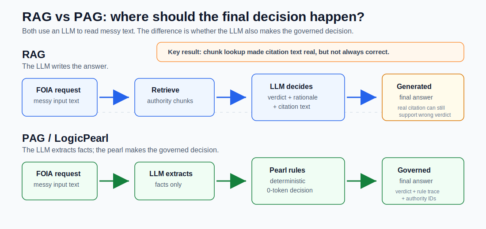
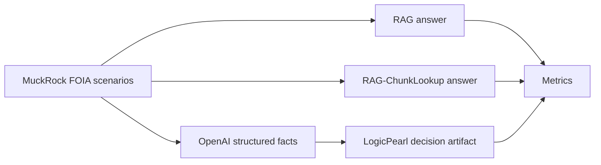

# RAG vs. PAG
*Retrieval Augmented Generation vs. Pearl Augmented Generation*



**TLDR:**

Maybe LLMs should read messy inputs, but not make the final governed decision.
After comparing normal RAG, chunk-lookup RAG, and what I'll refer to as PAG
(I hate naming things), PAG did better on the reported metrics in this benchmark.
The interesting thing is not that the LLM made up fake citations. It didn't.
The more interesting failure mode is that even chunk-based RAG often used real
citations incorrectly: it fetched the wrong citation to support its decision.
The pearl-based method makes the final decision from a rule trace instead of
letting the model choose the final citation. It's also easier to inspect,
rerun, diff, and regression-test.

> (A "pearl" is the best way I have found to describe a deterministic rules
> artifact, I've open sourced it as [LogicPearl](https://github.com/LogicPearlHQ/logicpearl), but TLDR it's a CLI tool that produces a
> deterministic runnable artifact
> that's automatically generated from traces via decision trees + solver +
> misc.)

I believe that while an LLM can pull facts out of messy documents (quite well
if you are doing chunk lookup based RAG), I think we've all mostly been trying to
get an LLM to do a better job at making the final decision.  But is that the most accurate
and scalable way, or would it be better to use a deterministic artifact that can be easily inspected,
uses 0 tokens for the final decision, and can be regression tested? (I think so personally; this repo is me trying to test that.)

For testing, I went with (USA) [FOIA](https://www.foia.gov/) (Freedom of Information Act) exemption classification.
I chose that because it's a legal-ish question, and it's a great example of where hallucinations or incorrect citations are probably not acceptable.

All of the input data for this I pulled from [MuckRock](https://www.muckrock.com/) (this site is amazing, I had no idea prior to this that it existed, they have a lot of solid government datasets).  Specifically I grabbed FOIA request/response records. The benchmark here compares ordinary RAG-style LLM answers against a "pearl" pipeline where the LLM extracts structured
facts, then a deterministic decision artifact chooses the final label.  I also do another comparison with RAG + Chunk Lookup, which is more fair because plain RAG on its own was worse than I expected.

Also I am not claiming to solve "FOIA law.", I don't have the legal knowledge
to even try to.  But I do believe this shows that a deterministic decision artifact
is easier to audit than a freeform generated verdict (LLM).

## What This Is

FOIA responses often cite exemptions such as `b5`, `b6`, `b7`, or `b8`.  Each of these is a reason why an agency might not have to turn over docs for a FOIA request.  For this example, I use the public request/response records to build labels and audit evidence, then I run all three pipelines to predict the exemption outcome in two tracks.

| Pipeline | Track A: end-to-end | Track B: shared facts |
|---|---|---|
| RAG | Retrieve FOIA authority text, then ask OpenAI to write a verdict, rationale, and quotes. | Give OpenAI the same extracted facts as everyone else, plus retrieved FOIA authority text, then ask for a verdict, rationale, and quotes. |
| RAG-ChunkLookup | Retrieve FOIA authority text, ask OpenAI for chunk IDs, then have the app resolve the quoted text from those chunks. | Give OpenAI the same extracted facts as everyone else, plus retrieved FOIA authority text, then ask for chunk IDs; the app resolves quoted text from those chunks. |
| LogicPearl | Ask OpenAI to extract facts, then run those facts through a versioned ruleset to produce the verdict. | Skip per-pipeline extraction and run the shared OpenAI-extracted facts through the same versioned ruleset. |

The important distinction is where the final decision happens. In RAG, the
model writes the verdict. In LogicPearl, the model feeds a structured fact
record into a deterministic artifact, and the artifact returns the verdict,
rule ID, and authority references.



## Why You Might Care

LLMs are good at reading messy text and turning it into structured signals.
They are much harder to audit when the final answer is a generated paragraph.

Chunk lookup can ensure the citation text is real because the app resolves it
from stored chunks. But it still does not prove the model picked the correct
chunk, and plain RAG can still write quote text itself.

This repo is meant to show that, and how to fix it (or my way of fixing it at least).
The thing that I think makes this unique is a "pearl" decision can
be easily tied to:

- the extracted feature dictionary;
- the ruleset version;
- the fired rule;
- authority IDs cited by that rule;
- corpus and artifact hashes;
- a regression suite.

That does not make the answer legally correct by magic. It makes the decision
path easier to inspect, rerun, and challenge.  (Yes you CAN audit from an LLM what
citation is cited, but you can't determine WHY it cited that)

## How To Read The Tracks

The benchmark reports two views:

| Track | What it measures |
|---|---|
| Track A: end-to-end | Each pipeline receives request text and agency name only. This includes extraction quality, retrieval quality, and decision behavior. |
| Track B: shared facts | One OpenAI structured extractor creates the same feature vector for every pipeline. This isolates the decision layer. |

Track B is useful because it asks: given the same facts, what happens when the
last step is generated text versus a governed decision artifact?

## Results

The strongest result is about auditability, not broad legal
accuracy. Under shared extracted facts, the pearl produces stable,
inspectable, trace-valid decisions. The generated baselines are harder to
audit even when they cite text.

How to read the columns:

| Column | Meaning |
|---|---|
| Acceptable | The pipeline's predicted label was one of the labels accepted for that scenario. This matters because real FOIA letters sometimes cite overlapping exemptions. |
| Citation supports | Of the citations the pipeline gave, how many actually support the pipeline's own verdict. For ChunkLookup, this checks whether the real resolved chunk matches the claimed exemption. |
| Wrong real citations | Citations that resolved to real retrieved text, but did not support the pipeline's own verdict. This is citation-level, not scenario-level. |

`Citation supports` checks support for the pipeline's own verdict, not whether
the verdict matches the gold label. A pipeline can cite evidence that supports
a wrong answer.

Full live test set, ambiguity-aware acceptable-label scoring:

| Track | Pipeline | Acceptable | Citation supports | Wrong real citations |
|---|---|---:|---:|---:|
| A: end-to-end | LogicPearl | 42/61 | 55/55 | 0 |
| A: end-to-end | RAG | 7/61 | 16/16 | 0 |
| A: end-to-end | RAG-ChunkLookup | 7/61 | 14/62 | 48 |
| B: shared facts | LogicPearl | 42/61 | 55/55 | 0 |
| B: shared facts | RAG | 14/61 | 28/36 | 8 |
| B: shared facts | RAG-ChunkLookup | 12/61 | 21/48 | 27 |

Approved-clean held-out test set:

| Track | Pipeline | Acceptable | Citation supports | Wrong real citations |
|---|---|---:|---:|---:|
| A: end-to-end | LogicPearl | 6/13 | 11/11 | 0 |
| A: end-to-end | RAG | 3/13 | 5/5 | 0 |
| A: end-to-end | RAG-ChunkLookup | 3/13 | 4/20 | 16 |
| B: shared facts | LogicPearl | 6/13 | 11/11 | 0 |
| B: shared facts | RAG | 4/13 | 7/7 | 0 |
| B: shared facts | RAG-ChunkLookup | 5/13 | 6/16 | 10 |

Every acceptable LogicPearl result in this run was also trace-valid: the
verdict came from a non-default rule with cited authority IDs. That was `42/42`
on the full live set and `6/6` on the approved-clean set.

Hallucinated or fabricated citations were `0` across these runs. The citation
failure mode was wrong real citations: chunks or excerpts that existed, but did
not support the verdict.

## Citation Failure Examples

RAG-ChunkLookup fixes one failure mode: the model cannot invent quote text,
because the app resolves citation text from stored chunk IDs. But it can still
pick the wrong real chunk.

Examples from the approved-clean run:

| Scenario | What happened |
|---|---|
| [`99793`](https://www.muckrock.com/foi/2019-fbinaa-hacking-incident/) | ChunkLookup predicted the right label, `b7`, for an FBI hacking-investigation request. But it cited real `b1` and `b5` chunks instead of the `b7` authority chunk, so citation support was `0/2`. |
| [`104856`](https://www.muckrock.com/foi/45q-form-request/) | ChunkLookup predicted `b8` for IRS Form 8933 records and cited the real `b8` chunk. The approved gold label is `b3`, because the IRS response relies on Section 6103 / return-information confidentiality. This is a real citation supporting the wrong answer. |
| [`63656`](https://www.muckrock.com/foi/beleave-suspicious-activity-reports-sars/) | ChunkLookup predicted `b8` for Suspicious Activity Reports and cited the real `b8` chunk. The approved gold label is `b3`, because FinCEN relies on Bank Secrecy Act protections through Exemption 3. |

## Important Caveats

- The gold labels are agency-cited exemptions from MuckRock response text.
  They are not court rulings.
- Many real FOIA responses are messy or cite overlapping exemptions, so the
  full live benchmark uses ambiguity-aware acceptable labels.
- `insufficient_facts` is an abstention, not a FOIA exemption.
- RAG and RAG-ChunkLookup are real OpenAI baselines, not fake heuristic
  stand-ins.
- The OpenAI extractor returns facts and evidence. It does not choose the gold
  exemption label.
- Repeated local report runs usually reuse cached model rows. Stability
  columns measure replay stability for this repo artifact, not fresh sampling
  variance.

## Limitations

This is not a broad legal benchmark. The gold labels are agency-cited
exemptions, not court-validated legal truth.

Many scenarios are underdetermined from request text alone. Track A partly
measures whether a pipeline can infer likely agency withholding behavior from
incomplete input.

Track B isolates the decision layer, but the shared feature schema is also the
schema used by the LogicPearl ruleset.

The approved-clean held-out set is small and should be treated as an audit
slice, not a sweeping accuracy claim.

The authority corpus is intentionally compact for reproducibility, so this is
not a full legal-research RAG benchmark.

Neither side is fully optimized. RAG could likely improve with richer
retrieval, better prompts, stronger models, reranking, or verifier passes.
LogicPearl could also improve with more traces, more rules, better feature
extraction, and a larger regression suite. This repo is a reproducible
first-pass comparison, not the final word on either approach.

## Quickstart

You need Python 3.11+, `uv`, and an OpenAI API key for the full benchmark.

```bash
uv sync --extra dev
export OPENAI_API_KEY=...
uv run make final-report
```

The default model is `gpt-4o-mini`. You can choose a different model:

```bash
uv run make final-report OPENAI_MODEL=your-model-name
```

For an offline confidence check that does not call OpenAI:

```bash
uv run make smoke
```

`smoke` runs unit tests, ruleset regression, and the ruleset diff. The unit
tests mock OpenAI boundaries.

## What To Read First

Start here if you just want the outcome and caveats:

- [Final benchmark report](docs/qa/final-benchmark-report.md)
- [Trace walkthrough](docs/demo/trace-viewer.md)
- [Glossary](docs/GLOSSARY.md)
- [Reproducibility note](docs/REPRODUCIBILITY.md)

Then read these if you want the benchmark construction details:

- [Benchmark methodology log](docs/qa/benchmark-methodology-log.md)
- [Scenario map](scenarios/README.md)
- [QA notes](docs/qa/README.md)

## Common Commands

Prefix these with `uv run` unless you have already activated the project
environment.

```bash
make final-report          # regenerate benchmark reports
make smoke                 # no-OpenAI confidence check
make test                  # run unit tests with mocked OpenAI boundaries
make regression            # test ruleset behavior
make diff-ruleset          # compare ruleset versions
make trace-viewer          # generate a small trace walkthrough
```

The full command list:

```bash
make fetch                 # create the compact FOIA authority corpus
make index                 # build the lexical retrieval index
make build                 # build versioned decision artifacts
make extract-live          # create shared OpenAI structured facts
make adjudicate-live       # create clean/ambiguous/invalid benchmark labels
make manual-review-clean   # apply the human-reviewed clean subset
make demo-live             # run full live benchmark
make demo-clean-approved   # run manually approved clean benchmark
make trace-viewer          # generate a small trace walkthrough
make final-report          # regenerate benchmark reports
make smoke                 # no-OpenAI confidence check
make regression            # test ruleset behavior
make test                  # run unit tests with mocked OpenAI boundaries
make clean                 # remove generated artifacts
```

## Repo Map

```text
compare.py                 benchmark CLI wrapper
benchmark/                 benchmark runner, metrics, and summary generation
corpus/                    compact FOIA authority corpus source
extraction/                shared OpenAI structured extraction
pipelines/                 RAG, RAG-ChunkLookup, and LogicPearl adapters
pearl/                     versioned decision artifacts and rulesets
rag/                       lexical index and retrieval
scenarios/                 active benchmark inputs and review sidecars
scenarios/archive/         corpus-construction history
scripts/                   benchmark report and adjudication scripts
scripts/corpus_build/      historical MuckRock scrape and QA helpers
docs/qa/                   final report and fairness audit trail
docs/demo/                 trace walkthrough
tests/                     unit tests with mocked OpenAI boundaries
```

Generated outputs include:

- `extraction/outputs/shared_features.100.live.openai.json`
- `transcripts/live-100-openai-summary.md`
- `transcripts/live-100-openai-clean-approved-summary.md`
- `docs/qa/final-benchmark-report.md`
- `docs/demo/trace-viewer.md`
